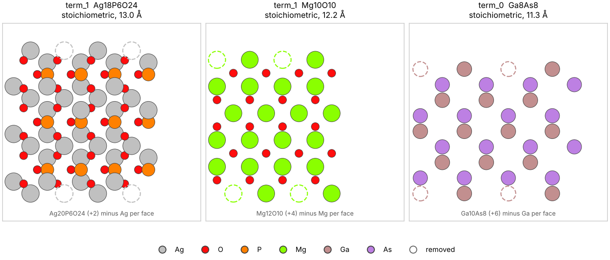

# Charge-Neutral Terminations

Find the slab terminations a semiconductor or insulator can actually have:
**two equivalent faces and zero net formal charge**. Use it to preview
surfaces in a few seconds, to write slabs for DFT, or inside the PS-TEROS
workflow with `termination_mode='charge_neutral'`.



*Dashed circles are atoms removed to make the slab neutral. Left: Ag3PO4(110)
loses one Ag per face. Middle: rock-salt (111) keeps half of its outer layer.
Right: GaAs(100) keeps half of its outer Ga layer.*

## Quick start

```python
from pymatgen.core import Structure
from psteros.core.terminations import find_charge_neutral_terminations

bulk = Structure.from_file('ag3po4.cif')
terminations = find_charge_neutral_terminations(
    bulk, (1, 1, 0), min_slab_thickness=10.0,
    oxidation_states={'Ag': 1, 'P': 5, 'O': -2},   # optional: guessed if omitted
    unit_bonds={('P', 'O'): 1.9},                  # keep PO4 groups whole
)
print(terminations)
```

```
Ag3PO4(110) | 1x1 surface cell | Ag+1 P+5 O-2 | kept whole: P-O

label   formula    atoms  thickness (Å)  stoich.  origin
------  ---------  -----  -------------  -------  ---------------------------------
term_0  Ag12P4O16  32     11.22          yes      Ag12P6O24 (-6) minus PO4 per face
term_1  Ag18P6O24  48     12.98          yes      Ag20P6O24 (+2) minus Ag per face

2 terminations, each symmetric with zero formal charge. Confirm the band gap with a single-point calculation.
```

Then:

```python
terminations.write('slabs/')          # term_0_Ag12P4O16.vasp, ..., terminations.json
terminations.plot('slabs.png')        # side views like the figure above
slab = terminations[1].structure      # a pymatgen Structure, c normal to the surface
```

In Jupyter the set displays as an HTML table. The result is a list of
`Termination` objects; each has `structure`, `formula`, `thickness`,
`is_stoichiometric`, `origin` (how it was made) and `to_dict()`.

A runnable version for Ag3PO4(110), GaAs(100) and ZnO(0001) is in
[`examples/charge_neutral_terminations/preview_terminations.py`](../examples/charge_neutral_terminations/preview_terminations.py).

## Command line

```bash
psteros-terminations ag3po4.cif 110 --oxidation Ag=1,P=5,O=-2 --keep P-O:1.9 \
    --write slabs/ --plot slabs.png
```

`psteros-terminations` is installed with the package (`pip install -e .`);
without installing, use `python -m psteros.core.terminations` with the same
arguments. It prints the same table. Miller indices can be written `110`, `"1 1 0"` or
`1,1,0`. Use `--supercell 2x1` to fix the surface cell and `--format cif` or
`extxyz` for other file types. A polar or impossible surface exits with
status 1 and an explanation.

## In the PS-TEROS workflow

```python
wg = build_core_workgraph(
    ...,
    miller_indices=[1, 1, 0],
    min_slab_thickness=10.0,
    min_vacuum_thickness=15.0,
    termination_mode='charge_neutral',
    oxidation_states={'Ag': 1, 'P': 5, 'O': -2},
    unit_bonds=[['P', 'O', 1.9]],
    # termination_supercell=[2, 1],   # optional; chosen automatically otherwise
)
```

Slabs are still named `term_0`, `term_1`, … so relaxation, thermodynamics and
the other stages work unchanged. The slab generation task also stores a
`termination_report` Dict with the table above and, per label, how the slab
was obtained. The default `termination_mode='pymatgen'` behaves exactly as
before.

## Why

Pymatgen's `SlabGenerator` returns every distinct cut. With
`symmetrize=True` it makes the two faces equivalent by deleting sites one by
one, without regard to valence. For an ionic semiconductor most of those
slabs carry a net formal charge. DFT then puts the surplus electrons in the
conduction band (or holes in the valence band) and the reference surface is
a metal.

For Ag3PO4(110) with `min_slab_size=10` and `symmetrize=True`, none of the
six slabs is neutral and four split PO4 groups:

| Slab | Formal charge | PO4 intact |
| --- | --- | --- |
| Ag12P6O20 | +2 | no |
| Ag16P6O24 | −2 | yes |
| Ag14P4O20 | −6 | no |
| Ag16P6O20 | +6 | no |
| Ag14P4O16 | +2 | yes |
| Ag18P4O20 | −2 | no |

At 15 Å the list includes Ag20P6O24 (+2), the Ag-rich S0 slab, whose 8 extra
electrons per 2×2 cell sit in the conduction band.

## How it works

A slab is kept if, with nominal oxidation states, its net formal charge is
zero (the electron-counting rule) and a symmetry operation maps one face onto
the other. Stoichiometry is **not** required: a neutral, off-stoichiometric
slab such as SrO-terminated SrTiO3(100) is closed-shell and is handled by the
chemical-potential dependent surface thermodynamics. For metals and alloys
every formal charge is zero, so only face symmetry is enforced.

1. **Polar check.** If no bulk operation reverses the surface normal, the
   direction is polar (zinc blende (111), wurtzite (0001)) and is reported.
2. **Units.** A thick slab is split into units: single atoms, or clusters
   joined by `unit_bonds` (PO4, CO3, SO4). Units are never split. The surface
   cell is reduced to the primitive one.
3. **Windows.** Every contiguous stack of atomic planes is a candidate; the
   symmetric ones are kept.
4. **Repair.** A symmetric stack with charge Q ≠ 0 loses surface units in
   symmetry-related pairs until Q = 0: whole outer planes first, then part of
   the next plane, with the fewest units per face. If the 1×1 cell cannot be
   neutralised, 2×1, 1×2 and 2×2 cells are tried.
5. **Duplicates.** Slabs with the same environment near the face are the
   same termination; the thinnest, simplest one is kept, within one bulk
   repeat above `min_slab_thickness`.

Formal charge is necessary, not sufficient. Confirm the band gap of each
candidate with a single-point calculation before production work.

## Tested materials

60 surfaces of 20 materials, 10 Å minimum thickness. Times are for one
surface on one core.

| Class | Material | Surface | Cell | Terminations found | Known result |
| --- | --- | --- | --- | --- | --- |
| Metal | Cu (fcc) | (111) | 1×1 | Cu6 | close-packed, one atom per plane |
| Metal | Mg (hcp) | (10-10) | 1×1 | Mg8, Mg10 | short- and long-gap cuts |
| Alloy | Cu3Au (L1₂) | (100) | 1×1 | Cu11Au3, Cu10Au4 | pure-Cu or mixed CuAu face |
| Alloy | CuAu (L1₀) | (001) | 1×1 | Cu4Au3, Cu3Au4 | Cu- or Au-terminated |
| Alloy | NiAl (B2) | (100) | 1×1 | Al4Ni5, Al5Ni4 | Ni- or Al-terminated |
| Covalent | Si | (111) | 1×1 | 2 × Si8 | shuffle and glide cuts |
| III-V | GaAs | (110) | 1×1 | Ga7As7 | non-polar cleavage plane |
| III-V | GaAs | (100) | 2×1 | Ga8As8 (−Ga), Ga8As8 (−As) | half-filled outer layer |
| III-V / II-VI | GaAs, CdTe | (111) | – | polar | Tasker type 3, no symmetric slab |
| Wurtzite | ZnO, GaN | (10-10) | 1×1 | Zn8O8, Zn10O10 | one or two bonds cut per atom |
| Wurtzite | ZnO, GaN | (0001) | – | polar | Tasker type 3 |
| Oxide | MgO | (111) | 2×1 | Mg10O10 (−O), Mg10O10 (−Mg) | half-filled outer layer |
| Oxide | TiO2 (rutile) | (110) | 1×1 | Ti8O16 + 2 variants | bridging-O stoichiometric slab |
| Oxide | CeO2 | (111) | 1×1 | Ce4O8 | O-terminated O–Ce–O trilayer |
| Oxide | CeO2, CaF2 | (100) | 1×1 | Ce4O8 (−O) | half the outer anions removed |
| Perovskite | SrTiO3 | (100) | 1×1 | Sr4Ti3O10, Sr3Ti4O11 | SrO- and TiO2-terminated |
| Perovskite | SrTiO3 | (110) | 1×1 | Sr4Ti4O12 (−O), Sr3Ti5O13 (−Sr) | O- or Sr-deficient face |
| Corundum | Al2O3 | (0001) | 1×1 | Al10O15 | single-Al termination |
| Halide | NaCl | (111) | 2×1 | Na8Cl8 (−Na), Na8Cl8 (−Cl) | half-filled outer layer |
| Phosphate | Ag3PO4 | (110) | 1×1 | Ag18P6O24, Ag12P4O16 | Ag18P6O24 matches a relaxed closed-shell slab |
| Carbonate | CaCO3 (calcite) | (104) | 1×1 | Ca8C8O24 | stoichiometric cleavage plane, CO3 intact |

Every surface took under 6 s (most under 1 s). The automated version of this
table is `tests/test_terminations.py::test_survey`.

## Options

| Option | Meaning |
| --- | --- |
| `min_slab_thickness` | Minimum distance between the outermost nuclei (Å). Slabs come within one bulk repeat above it. |
| `min_vacuum_thickness` | Vacuum (Å), default 15. |
| `oxidation_states` | Element → nominal oxidation state. Guessed if omitted; zero for metals and alloys. |
| `unit_bonds` | Bonds never broken, for polyanions: `{('P', 'O'): 1.9}`, `{'P-O': 1.9}` or `[['P', 'O', 1.9]]`. Framework cation–anion bonds form an extended network and are rejected. |
| `supercell` | Surface cell `(n1, n2)`. Default: the first of 1×1, 2×1, 1×2, 2×2 that works. |
| `surface_depth` | How deep the partially emptied plane may lie (Å). Default: half the bulk repeat. |
| `max_removed_per_face` | Default: 4 per surface cell. |
| `max_variants_per_window` | Cap on removal patterns per stack (default 20); a warning is issued when the list is cut. |

Other helpers: `classify_slab(slab, bulk, oxidation_states)` reports charge,
face symmetry and stoichiometry of any slab (for example one passed as
`input_slabs`); `has_face_reversing_operation(bulk, hkl)` tells whether a
direction is polar.

## Limits

- One oxidation state per element. Reduced surfaces with mixed valence (for
  example SnO2 with surface Sn²⁺) appear charged under fixed Sn⁴⁺.
- Units are only removed, never added.
- For covalent semiconductors formal charges are only bookkeeping: Si has
  none, so only symmetry is enforced, and for GaAs the ±3 count reproduces
  electron counting only roughly. Reconstructions such as Si(100)-(2×1)
  dimers are not generated.
- Polar directions are reported, not handled. They need an asymmetric slab
  with a dipole correction or a passivated back face.
