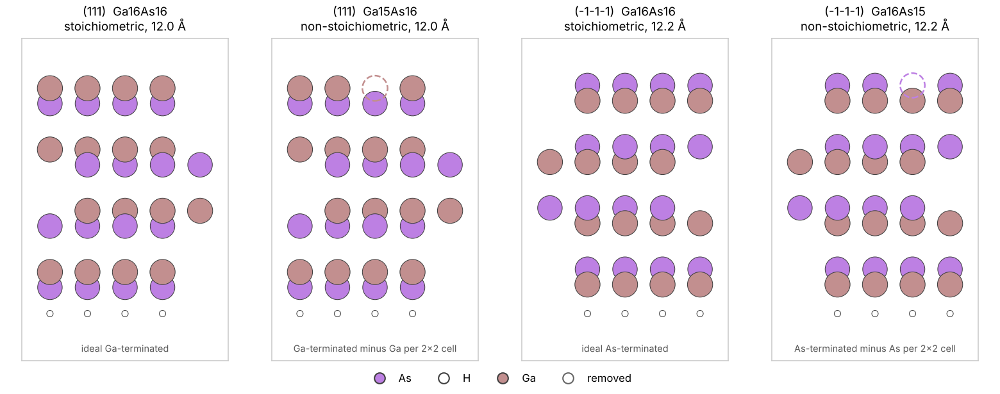

# Absolute Surface Energies of Polar Surfaces

## Summary

A polar slab, such as zinc-blende (111) or wurtzite (0001), cannot have two
equivalent faces: its top and bottom are different surfaces, so its energy is
the sum of two unknown surface energies. PS-TEROS passivates the bottom with
**pseudo-hydrogen** and obtains the **absolute** energy of the top face,
following

> Y. Zhang *et al.*, *Pseudo-Hydrogen Passivation: A Novel Way to Calculate
> Absolute Surface Energy of Zinc Blende (111)/(-1-1-1) Surface*,
> Sci. Rep. **6**, 20055 (2016);
> J. Zhang *et al.*, *Surface energy calculations from zinc blende
> (111)/(-1-1-1) to wurtzite (0001)/(000-1): a study of ZnO and GaN*,
> arXiv:1510.08961.

The result goes into the usual ab initio atomistic thermodynamics,
γ(Δμ), on the same absolute scale as symmetric (non-polar) slabs, so polar
and non-polar orientations can be compared and fed into a Wulff
construction. The method targets tetrahedrally bonded III-V and II-VI
compounds (GaAs, GaN, ZnO, ZnS, CdTe, ...) and runs with VASP.



*Two faces of GaAs, each with its own passivated bottom (small circles:
pseudo-hydrogen). Left: Ga-terminated (111), ideal and with one Ga vacancy per
2×2 cell (electron counting). Right: As-terminated (-1-1-1), ideal and with an
As vacancy.*

## The method

**Pseudo-hydrogen.** Every bond broken at the bottom is saturated by a
hydrogen with a fractional nuclear charge 2 − Z/4, where Z is the number of
valence electrons of the bottom atom. That completes the electron pair of the
bond, so the bottom is closed-shell and electronically separate from the top.

| Bottom atom | Z | Pseudo-H | VASP POTCAR | AiiDA kind |
| --- | --- | --- | --- | --- |
| O, S, Se | 6 | 0.5 | `H.5` | `H0p5` |
| N, P, As | 5 | 0.75 | `H.75` | `H0p75` |
| Si, Ge | 4 | 1.0 | `H` | `H` |
| Al, Ga, In | 3 | 1.25 | `H1.25` | `H1p25` |
| Zn, Cd | 2 | 1.5 | `H1.5` | `H1p5` |

**Absolute energy of the top face** (Sci. Rep. Eq. 5):

γ_top = [E_slab − Σ_i n_i μ_i − Σ_k n_k μ̂_k] / A

with μ_A and μ_B tied to the bulk (x μ_A + y μ_B = E_bulk) and μ̂_k the
**pseudo chemical potential** of a pseudo-hydrogen. μ̂ contains the whole
energy of the passivated bottom, so nothing else about the bottom is needed.

**Pseudo chemical potentials.** Two ways, as in the papers:

* **Pseudo-molecules** (default): the CH4-like molecule X(H_X)4, eight valence
  electrons, relaxed at Γ:  μ̂_HX = [E(X(H_X)4) − μ_X] / 4.
* **Tetrahedral clusters** (optional, more accurate): zinc-blende tetrahedra
  with four passivated (111) facets, sizes n = 2…9; their energies are fitted
  to Sci. Rep. Eq. 9 for the face, edge and corner pseudo-H; the face value is
  the one for (111) surfaces. Wurtzite compounds use zinc-blende clusters.

Both give dμ̂/dμ_X = −1/4, so PS-TEROS stores μ̂ = κ − μ_X/4 and evaluates it
at every Δμ. A polar face therefore depends on Δμ even when the slab is
stoichiometric, as it should.

## The same-bottom requirement

When two slabs of one face are compared, they must have the **same bottom**.
PS-TEROS enforces this at three points:

1. **Construction.** `find_polar_terminations` builds every top of one face
   on one bottom, copied atom for atom, in one surface cell (the smallest cell
   any requested top needs).
2. **Fingerprint.** Each slab carries a hash of its bottom region (atoms and
   pseudo-H within one bulk repeat of the bottom) and of the surface cell.
   `surface_phase_diagram` refuses passivated slabs of one face with different
   fingerprints.
3. **After relaxation.** Every atom is relaxed, as in the papers. Then
   `check_bottoms` compares the relaxed bottom of each slab with the reference
   slab (RMSD ≤ 0.02 Å, largest deviation ≤ 0.05 Å after removing a rigid
   shift; cell unchanged). Slabs that fail are left out of the phase diagram.

## Quick start: the slabs

```python
from pymatgen.core import Structure
import psteros

bulk = Structure.from_file("GaAs_relaxed.cif")
slabs = psteros.find_polar_terminations(bulk, (1, 1, 1))   # bilayers=9 by default
print(slabs)
slabs.write("gaas_111/")        # POSCARs (pseudo-H as separate species) + terminations.json
slabs.plot("gaas_111.png")
```

```
GaAs(111) | polar | 2x2 surface cell | top Ga, bottom As + H0.75(As) (shared)

label   formula   pseudo-H     atoms  thickness (Å)  e-count  origin
------  --------  -----------  -----  -------------  -------  -----------------------------------
term_0  Ga36As36  4 H0.75(As)  76     28.33          no       ideal Ga-terminated
term_1  Ga35As36  4 H0.75(As)  75     28.33          yes      Ga-terminated minus Ga per 2x2 cell

2 slabs on one bottom (fingerprint d7f1fa9d25503dcb).
```

The top face is the (hkl) face; `(-1, -1, -1)` gives the As-terminated face
on a Ga + H1.25 bottom. `term_0` is the ideal, unreconstructed top (the case
tabulated in the papers); `term_1` satisfies the electron-counting rule.
`electron_counting=False` keeps only the ideal top in a 1×1 cell.

## The full VASP calculation

```python
study = psteros.PolarSurfaceStudy(
    bulk,
    faces=[(1, 1, 1), (-1, -1, -1)],
    references={"Ga": ga_bulk, "As": as_bulk},   # O2 or N2 in a box for oxides and nitrides
    bilayers=9,
    pseudo_hydrogen_method="molecules",          # or "clusters"
    nonpolar_check=(1, 1, 0),                    # validation, recommended
)
config = psteros.SurfaceWorkflowConfig(
    backend="vasp",
    calculation=psteros.VaspCalculationConfig(
        code_label="vasp@cluster",
        incar={"ENCUT": 400, "PREC": "Accurate", "EDIFF": 1e-6,
               "IBRION": 2, "NSW": 200, "EDIFFG": -0.005},
        potential_family="PBE",
        potential_mapping=study.potential_mapping({"Ga": "Ga_d", "As": "As"}),
        kpoints_spacing=0.2,
    ),
    execution=psteros.ExecutionPolicy(computer="cluster", queue="normal", max_concurrent_jobs=1),
    role_overrides=study.vasp_overrides(),
)
graph = psteros.build_surface_workgraph(study.structures, config, submit=True)
```

`study.structures` holds every calculation: the bulk (at its relaxed cell),
the elemental references, the slabs of each face, the pseudo-molecules (or
clusters), the slab passivated on both faces (Eq. 7 check) and the non-polar
pair. `vasp_overrides()` adds, per structure: fixed cell (`ISIF=2`) and a
dipole correction (`LDIPOL`, `IDIPOL=3`, `DIPOL` at the slab centre) for
asymmetric slabs; `ISIF=3` for solid references; Γ-only for molecules,
clusters and gas references, with a triplet O2. `potential_mapping()` adds the
pseudo-hydrogen POTCARs; your POTCAR family must contain them.

The solid references relax their cell, so their relaxation energies carry a
basis-set error. For final energies, run a static calculation after every
relaxation with the same overrides per stage:

```python
static = psteros.SurfaceWorkflowConfig(
    backend="vasp",
    calculation=psteros.VaspCalculationConfig(..., incar={..., "IBRION": -1, "NSW": 0}),
    execution=config.execution, name="gaas_polar_static",
    role_overrides=study.vasp_overrides("static"),
)
graph = psteros.build_relax_static_workgraph(study.structures, config, static, submit=True)
```

`read_vasp_results` reads either graph.

When the graph has finished:

```python
from aiida import orm

energies, relaxed = psteros.read_vasp_results(orm.load_node(graph.pk), study.structures)
result = study.analyse(energies, relaxed)
print(result)       # references, muhat, bottom checks and consistency checks
result.diagram.plot("gaas_polar_phase_diagram.png")
result.diagram.to_csv("gaas_polar_phase_diagram.csv")
```

It prints, with your numbers in place of the dots:

```
GaAs: Delta mu_As from ... to 0 eV
  muhat(H on As) = ... eV - mu_As/4 (pseudo-molecule)
  muhat(H on Ga) = ... eV - mu_Ga/4 (pseudo-molecule)
  GaAs_111: bottom check passed
  GaAs_m1m1m1: bottom check passed
  Eq. 7 (both faces passivated): ... meV/Ų (... %)
  non-polar face, passivated vs symmetric slab: ... meV/Ų (... %)
```

A complete script, with a dry run that only builds the structures, is
[`examples/polar_surfaces/gaas_polar_vasp.py`](../examples/polar_surfaces/gaas_polar_vasp.py).

The phase diagram holds every top that passed the bottom check, labelled by
face (`GaAs_111_term_1`, ...), in absolute J/m² or eV/Ų. Symmetric slabs of
other orientations can be added to the same diagram with
`psteros.SlabTermination(...)` and the same references.

## Checks

* **Bottom check** (`check_bottoms`): see above; `result.bottom_checks[face]`
  prints a table of RMSD, largest deviation and relaxation for every slab.
* **Eq. 7** (`eq7_check`): a slab passivated on both faces gives
  n_A μ̂_A + n_B μ̂_B directly; the difference from the pseudo-molecules or
  clusters is the error of μ̂. The papers find ≤ 6 meV/Ų for pseudo-molecules
  and ≤ 1 meV/Ų for clusters (zinc blende).
* **Non-polar check** (`nonpolar_check`): γ of a non-polar face from a
  symmetric slab and from a passivated slab must agree; the difference
  estimates the error of the polar energies.

## Settings and benchmarks

Settings of the papers: VASP, PBE, 400–500 eV cutoff, ≥ 15 Å vacuum, 9–10
bilayers, 1×1 slabs with 10×10×1 to 15×15×1 k-points, molecules and clusters
at Γ, forces below 0.005 eV/Å, all atoms relaxed.

Absolute surface energies of unreconstructed (ideal) surfaces, GGA,
anion-rich limit, cluster method, in meV/Ų (arXiv:1510.08961, Table 3), to
check an installation against:

| Surface | γ |
| --- | --- |
| ZnO (0001), Zn-terminated | 147.7 |
| ZnO (000-1), O-terminated | 63.1 |
| GaN (0001), Ga-terminated | 168.3 |
| GaN (000-1), N-terminated | 198.2 |

and, for GaAs (Sci. Rep. 2016), 39.2 meV/Ų for V_Ga (111)-2×2 and 51.2
meV/Ų for V_As (-1-1-1)-2×2. Read γ at the anion-rich end of the window
(Δμ_anion = 0); with pseudo-molecules the papers report values within a few
meV/Ų of these.

## API

| Name | Purpose |
| --- | --- |
| `pseudo_hydrogens(bulk)` | `{element: PseudoHydrogen}` with charge, formal charge, kind name, POTCAR |
| `find_polar_terminations(bulk, hkl, ...)` | Slabs of one face on one passivated bottom (`PolarTerminationSet`) |
| `pseudo_molecule(bulk, element)` | X(H_X)4 molecule |
| `tetrahedral_cluster(bulk, outer, size)` | Passivated tetrahedral cluster; `cluster_counts(size)` gives its counts |
| `PseudoHydrogenReferences.from_pseudo_molecules(energies)` | μ̂ from molecule energies |
| `fit_cluster_pseudo_chemical_potentials(outer, energies, mu)` | μ̂ from cluster energies (Eq. 9) |
| `SlabTermination.from_polar(slab, energy)` | A one-face termination for `surface_phase_diagram(..., pseudo_hydrogen=...)` |
| `check_bottoms(slabs, relaxed)` | Post-relaxation bottom check |
| `eq7_check`, `nonpolar_check` | Consistency checks in meV/Ų |
| `PolarSurfaceStudy` | The whole VASP calculation set and its analysis |

## Limits

* Tetrahedral compounds only (four-fold coordinated atoms); other structures
  have no unique pseudo-hydrogen charge.
* Tops: the ideal termination and vacancy tops that satisfy electron counting.
  Adatoms, dimers and other reconstructions must be built separately; they
  can still use the bottom of a `PolarTerminationSet`.
* VASP only for now (the fractional-charge POTCARs).
* GGA underestimates gaps and polar surface energies; the papers also give
  HSE values.
