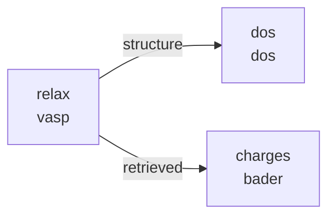

# Plan: Explicit Brick Connections for the Lego Module

*Created: 2026-02-01*
*Status: BRAINSTORMING / DRAFT*

---

## Problem Statement

Currently, brick connections (which outputs from one brick feed into which inputs of another) are **implicit**. The logic lives scattered across `validate_stage()`, `create_stage_tasks()`, and `resolve_structure_from()`. A user writing a run script must read source code or documentation to understand:

1. What each brick **provides** (its outputs/sockets)
2. What each brick **requires** (its inputs from other stages)
3. Which brick types are **compatible** with each other's connections

For example:
- `bader` requires `charge_from` → a `vasp` stage (hard-coded check in `bader.py:68`)
- `dos` requires `structure_from` → any stage that has a structure, but it doesn't produce a new structure itself
- `vasp` is a "joker" — it produces structure, energy, remote_folder, retrieved, etc. and can connect to almost anything

This makes it hard to:
- Add new bricks without studying all existing ones
- Validate user-defined pipelines early (before submission)
- Auto-suggest valid connections in tooling or error messages

---

## Design Goals

1. **Explicit port declarations** — Each brick declares what it provides and what it needs
2. **Compile-time validation** — When the user defines stages, validate all connections before submitting to AiiDA
3. **Self-documenting** — A user can inspect a brick to see its ports without reading source code
4. **Backward compatible** — Existing run scripts continue to work
5. **Minimal boilerplate** — Adding a new brick should stay lightweight

---

## Proposed Architecture

### 1. Port Declarations per Brick

Each brick module gains a `PORTS` dict (or a function `get_ports()`) that declares inputs and outputs:

```python
# bricks/vasp.py

PORTS = {
    'inputs': {
        'structure': {
            'type': 'structure',        # Port type (for matching)
            'required': True,
            'source': 'auto',           # 'auto' = previous stage or structure_from
            'description': 'Input structure (from previous stage, structure_from, or initial)',
        },
        'restart_folder': {
            'type': 'remote_folder',
            'required': False,
            'source': 'restart',        # Resolved via 'restart' field in stage config
            'description': 'Remote folder for WAVECAR/CHGCAR restart',
        },
    },
    'outputs': {
        'structure': {
            'type': 'structure',
            'description': 'Relaxed structure (only if NSW > 0)',
            'conditional': 'nsw > 0',   # Only available when relaxation is on
        },
        'energy': {
            'type': 'energy',
            'description': 'Total energy (eV)',
        },
        'misc': {
            'type': 'misc',
            'description': 'Parsed VASP results dict',
        },
        'remote_folder': {
            'type': 'remote_folder',
            'description': 'Remote calculation directory',
        },
        'retrieved': {
            'type': 'retrieved',
            'description': 'Retrieved files (CONTCAR, OUTCAR, etc.)',
        },
    },
}
```

```python
# bricks/dos.py

PORTS = {
    'inputs': {
        'structure': {
            'type': 'structure',
            'required': True,
            'source': 'structure_from',
            'description': 'Structure to compute DOS for',
        },
    },
    'outputs': {
        'energy': {
            'type': 'energy',
            'description': 'SCF energy',
        },
        'scf_misc': {
            'type': 'misc',
            'description': 'SCF parsed results',
        },
        'dos_misc': {
            'type': 'misc',
            'description': 'DOS parsed results',
        },
        'dos': {
            'type': 'dos_data',
            'description': 'DOS ArrayData',
        },
        'projectors': {
            'type': 'projectors',
            'description': 'Projected DOS data',
        },
        # NOTE: no 'structure' output — DOS doesn't modify structure
    },
}
```

```python
# bricks/bader.py

PORTS = {
    'inputs': {
        'charge_files': {
            'type': 'retrieved',
            'required': True,
            'source': 'charge_from',
            'compatible_bricks': ['vasp'],  # Only VASP produces AECCAR files
            'description': 'Retrieved folder with AECCAR0, AECCAR2, CHGCAR',
        },
        'structure': {
            'type': 'structure',
            'required': True,
            'source': 'charge_from',    # Gets structure from same stage
            'description': 'Structure for Bader assignment',
        },
    },
    'outputs': {
        'charges': {
            'type': 'bader_charges',
            'description': 'Bader charges per atom (Dict)',
        },
    },
}
```

### 2. Port Type System

Port types define what kind of data flows through a connection. The key insight is that **connection compatibility is determined by port type matching**, not brick type checking.

```python
# Proposed port type hierarchy:

PORT_TYPES = {
    'structure':     'StructureData — atomic positions + cell',
    'energy':        'Float — total energy in eV',
    'misc':          'Dict — parsed calculation results',
    'remote_folder': 'RemoteData — link to files on cluster',
    'retrieved':     'FolderData — files retrieved from cluster',
    'dos_data':      'ArrayData — density of states',
    'projectors':    'ArrayData — projected DOS data',
    'bader_charges': 'Dict — Bader charges per atom',
    'trajectory':    'TrajectoryData — MD trajectory',
    'convergence':   'Dict — convergence test results',
}
```

Two ports can be connected if they have the **same type** (or, in the future, compatible types). Additionally, some ports may have `compatible_bricks` constraints for cases where the type alone isn't sufficient (e.g., bader needs AECCAR files which only VASP produces).

### 3. Connection Resolution

The `source` field in input ports tells the system how to resolve the connection:

| Source Value | Resolution Logic |
|---|---|
| `'auto'` | Previous stage (default chain), `structure_from`, or initial input |
| `'structure_from'` | Look up `stage['structure_from']` to find the source stage |
| `'charge_from'` | Look up `stage['charge_from']` to find the source stage |
| `'restart'` | Look up `stage['restart']` to find the restart stage |
| `'explicit'` | User must provide the data directly in the stage config |

This is essentially formalizing what already happens today, but making it inspectable.

### 4. Validation at Stage Definition Time

When the user calls `quick_vasp_sequential(stages=...)`, the system should:

```python
def validate_connections(stages):
    """Validate all inter-stage connections before submission."""
    available_outputs = {}  # stage_name -> {port_name: port_type}

    for stage in stages:
        brick = get_brick_module(stage.get('type', 'vasp'))
        ports = brick.PORTS

        # Check that every required input can be satisfied
        for input_name, input_port in ports['inputs'].items():
            if not input_port['required']:
                continue

            source_key = input_port['source']
            if source_key == 'auto':
                # Auto-resolved from previous stage or structure_from
                continue  # handled by existing logic

            # Get the stage name this input references
            ref_stage_name = stage.get(source_key)
            if ref_stage_name is None:
                raise ValueError(
                    f"Stage '{stage['name']}': input '{input_name}' requires "
                    f"'{source_key}' field but it's missing"
                )

            if ref_stage_name not in available_outputs:
                raise ValueError(
                    f"Stage '{stage['name']}': '{source_key}={ref_stage_name}' "
                    f"references unknown stage"
                )

            # Check type compatibility
            ref_outputs = available_outputs[ref_stage_name]
            matching = [
                name for name, otype in ref_outputs.items()
                if otype == input_port['type']
            ]
            if not matching:
                raise ValueError(
                    f"Stage '{stage['name']}': input '{input_name}' needs type "
                    f"'{input_port['type']}' but stage '{ref_stage_name}' "
                    f"only provides: {list(ref_outputs.keys())}"
                )

            # Check brick compatibility constraint
            if 'compatible_bricks' in input_port:
                ref_brick_type = ... # look up from stages
                if ref_brick_type not in input_port['compatible_bricks']:
                    raise ValueError(
                        f"Stage '{stage['name']}': input '{input_name}' is only "
                        f"compatible with bricks: {input_port['compatible_bricks']}, "
                        f"but '{ref_stage_name}' is type '{ref_brick_type}'"
                    )

        # Register this stage's outputs
        available_outputs[stage['name']] = {
            name: port['type']
            for name, port in ports['outputs'].items()
        }
```

This gives **clear error messages** at definition time rather than cryptic failures deep inside AiiDA.

---

## How This Changes User-Facing Run Scripts

### Before (current — implicit connections):

```python
stages = [
    {
        'name': 'relax',
        'type': 'vasp',
        'incar': incar_relax,
        'restart': None,
        'kpoints_spacing': 0.06,
    },
    {
        'name': 'dos',
        'type': 'dos',
        'structure_from': 'relax',     # User must know DOS needs this field
        'scf_incar': {...},
        'dos_incar': {...},
    },
    {
        'name': 'charges',
        'type': 'bader',
        'charge_from': 'relax',        # User must know bader needs this field
    },
]
```

### After (explicit — same syntax, better validation):

The run scripts **stay the same**. The change is internal: each brick now declares its ports, and validation uses port declarations instead of ad-hoc checks. The user gets better error messages:

```
# Current error (cryptic):
ValueError: Bader stage 'charges' charge_from='dos' must reference a VASP stage (got type='dos')

# Proposed error (informative):
ValueError: Stage 'charges': input 'charge_files' needs type 'retrieved' with
AECCAR files, which is only provided by bricks: ['vasp']. Stage 'dos' is type
'dos' and doesn't produce compatible output.

Did you mean to reference 'relax' (type: vasp) instead?
```

---

## The "Joker" Pattern: VASP Brick

The `vasp` brick is special because it provides almost every port type. It's the universal connector:

```
vasp outputs: structure, energy, misc, remote_folder, retrieved
                  │          │       │        │              │
                  ▼          ▼       ▼        ▼              ▼
            ┌─────────┬─────────┬────────┬─────────┬──────────────┐
            │  dos    │ batch   │ thermo │  vasp   │    bader     │
            │(struct) │(struct) │ (misc) │(restart)│(charge_files)│
            └─────────┴─────────┴────────┴─────────┴──────────────┘
```

Specialized bricks have narrower output sets and thus fewer valid downstream connections:

```
dos outputs:   energy, scf_misc, dos_misc, dos, projectors
                  │                                  │
                  ▼                                  ▼
            ┌─────────┐                       ┌──────────┐
            │  (few   │                       │(analysis │
            │  uses)  │                       │  bricks) │
            └─────────┘                       └──────────┘

bader outputs: charges
                  │
                  ▼
            ┌──────────┐
            │(analysis │
            │  bricks) │
            └──────────┘
```

---

## Optional Enhancement: Brick Inspection API

Expose port information so users and tools can query it:

```python
from teros.core.lego.bricks import get_brick_info

# What does a vasp brick provide?
info = get_brick_info('vasp')
print(info['outputs'])
# {'structure': 'StructureData', 'energy': 'Float', 'misc': 'Dict', ...}

# What does a bader brick need?
info = get_brick_info('bader')
print(info['inputs'])
# {'charge_files': {'type': 'retrieved', 'from': 'charge_from', 'compatible': ['vasp']},
#  'structure': {'type': 'structure', 'from': 'charge_from'}}

# What bricks can I connect after a 'vasp' stage?
from teros.core.lego.bricks import get_compatible_bricks
print(get_compatible_bricks('vasp'))
# ['vasp', 'dos', 'batch', 'bader', 'convergence', 'aimd', ...]

# What bricks can I connect after a 'dos' stage?
print(get_compatible_bricks('dos'))
# ['vasp' (if structure passed through), ...]
```

---

## Optional Enhancement: Connection Visualization

Show the pipeline as ASCII or Mermaid for the user:

```python
from teros.core.lego import visualize_pipeline

visualize_pipeline(stages)
```

Output:
```
relax (vasp) ──structure──► dos (dos)
     │
     └──────retrieved──► charges (bader)
```

Or as Mermaid for notebooks:


---

## Implementation Plan

### Phase 1: Port Declarations (Low effort, high value)

1. Add `PORTS` dict to each existing brick module (`vasp`, `dos`, `batch`, `bader`, `convergence`)
2. Add `get_brick_info()` function to `bricks/__init__.py`
3. No behavioral changes — this is purely declarative metadata

### Phase 2: Validation Refactor (Medium effort, high value)

1. Create `validate_connections()` in `bricks/__init__.py`
2. Refactor each brick's `validate_stage()` to use port declarations
3. Call `validate_connections()` at the top of `quick_vasp_sequential()` before any AiiDA calls
4. Improve error messages with suggestions ("Did you mean...?")

### Phase 3: Connection Resolution Refactor (Medium effort)

1. Create `resolve_port()` generic function that uses port declarations
2. Refactor `resolve_structure_from()` to be port-generic
3. Each brick's `create_stage_tasks()` uses `resolve_port()` instead of custom logic

### Phase 4: Inspection & Visualization (Low effort, nice to have)

1. `get_compatible_bricks()` — query which bricks can follow another
2. `visualize_pipeline()` — ASCII / Mermaid pipeline diagram
3. Integration with `print_sequential_results()` to show the pipeline shape

---

## Open Questions

1. **Should port declarations be a dict or a class?**
   - Dict: simpler, consistent with the module-based (not class-based) brick pattern
   - Class (e.g., `Port`, `InputPort`, `OutputPort`): more structured, IDE-friendly
   - **Leaning toward:** Dict for now, can always wrap later

2. **How to handle conditional outputs?**
   - VASP `structure` output only exists when NSW > 0
   - Options: (a) `conditional` field with a simple expression, (b) always declare it and handle missing gracefully, (c) separate "static vasp" and "relaxation vasp" brick types
   - **Leaning toward:** (b) — declare it, but add `conditional` hint for docs/validation warnings

3. **Should `structure_from` / `charge_from` / `restart` be unified into a single `connections` dict?**
   - Current: each brick has its own field names (`structure_from`, `charge_from`)
   - Unified alternative:
     ```python
     {
         'name': 'charges',
         'type': 'bader',
         'connect': {
             'charge_files': 'relax.retrieved',
             'structure': 'relax.structure',
         },
     }
     ```
   - **Leaning toward:** Keep current field names for backward compatibility, but add optional `connect` dict as a more explicit alternative. The port system validates both styles.

4. **How to handle the "pass-through structure" pattern?**
   - DOS doesn't modify structure, so if a later stage needs structure, it should look through DOS to its source
   - Options: (a) explicit `structure` pass-through port, (b) `resolve_structure_from` walks the chain, (c) user must point to the original vasp stage
   - **Leaning toward:** (c) — keep it explicit, the user writes `structure_from: 'relax'` not `structure_from: 'dos'`

5. **Port type strictness?**
   - Should the system reject `structure_from: 'dos'` (since DOS has no structure output)?
   - Or should it allow it and resolve the chain automatically?
   - **Leaning toward:** Reject with a helpful message: "Stage 'dos' doesn't produce a structure. Did you mean 'relax'?"

---

## Summary

The core change is adding **declarative port metadata** to each brick module. This enables:

- Better validation with clear error messages
- Self-documenting bricks (inspect ports without reading source)
- A foundation for auto-wiring, visualization, and tooling
- No breaking changes to existing run scripts

The VASP brick remains the "joker" with the broadest output set. Specialized bricks have narrow, well-defined ports that constrain what they can connect to.
